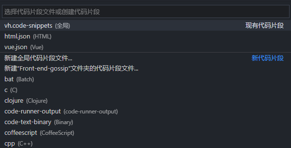
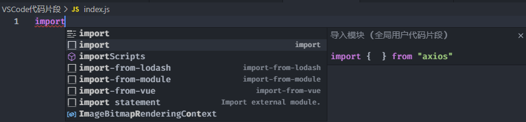
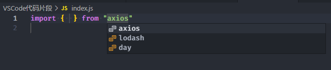

# 来为VSCode定义代码片段，让coding速度快到飞起~

## 写在前面

代码片段可以理解为模板，当我们输入指定时，按下【tab】或者【enter】即可出现对应的模板。

只要代码片段写的好，升职加薪少不了~

### 代码片段的好处与坏处

coder对代码片段的评价褒贬不一，下面这张图解释了代码片段的好处与坏处：


### 何时使用代码片段

关于什么时候使用代码片段，我的建议是：

- 当你对一个东西足够熟练，例如`console.log()`，这个时候可以为其设置代码片段。
- 有些东西特别繁琐，每次都需要写一遍，例如Vue单文件中的初步定义的内容。

当然，上面的内容仅仅是我的建议。

## 如何设置代码片段

首先你准备一个VSCode，然后确定你操作系统，然后开始操作：

- Windows系统:【 文件】→【首选项】→【用户片段】
- Mac系统: 【Code】→【首选项】→【用户片段】

然后你就可以看到下面这个内容



然后你就可以对现有的代码片段进行修改，或者创建一个新的代码片段，这里我们创建一个名为`test-snippets`的全局代码片段，来进行演示。

## 代码片段语法

我们创建完成以后，会出现一个类似于JSON的语法，内容如下：

```JSON
{
  // Place your 全局 snippets here. Each snippet is defined under a snippet name and has a scope, prefix, body and 
  // description. Add comma separated ids of the languages where the snippet is applicable in the scope field. If scope 
  // is left empty or omitted, the snippet gets applied to all languages. The prefix is what is 
  // used to trigger the snippet and the body will be expanded and inserted. Possible variables are: 
  // $1, $2 for tab stops, $0 for the final cursor position, and ${1:label}, ${2:another} for placeholders. 
  // Placeholders with the same ids are connected.
  // Example:
  // "Print to console": {
  //   "scope": "javascript,typescript",
  //   "prefix": "log",
  //   "body": [
  //     "console.log('$1');",
  //     "$2"
  //   ],
  //   "description": "Log output to console"
  // }
}
```


接下来我们对VSCode中的代码片段语法进行学习。

首先中的内容是被一个对象进行包裹，对象中的每一个属性表示一个代码片段，属性名为代码片段的名称，在触发代码片段的时候会展示匹配到的代码片段名称，例子中的属性名称为`Print to console`。

接下来我们学习代码片段内每个属性是干什么的。

- `scope`：表示代码片段作用于哪种语言。 不同语言之间以`,`隔开。 常用的有`javascript, typescript,html,css,vue`等。 如果设置为`""`就代表所有地方都生效。
- `prefix`：对应触发代码片段的字符。
- `description`：代码片段的描述。
- `body`：对象代码片段的内容，通常为一个数组，数组内的一行对应生成代码片段后的一行。

推荐一个用于生成代码片段的网站，链接如下：

[https://snippet-generator.app/](https://snippet-generator.app/)

### $占位符

上面的例子中，我们输入`log`按下【tab】键即可出现如下代码：

```
console.log();


```


出现这段内容后，光标在`()`内，然后按下【tab】键，光标即可调到下一行，也就是`$2`的位置，同样的道理，我们还可以设置`$3`、`$4` 等等

值得注意的是：`$0`用于设置最终光标的位置。

### 默认与可选项

如果想让占位符中具有一个默认值，可以通过`${1:defalt}`的形式来编写。

如果行提供一些选项，可以通过`${1|one,two,three|}`的形式来编写，例如：

```JSON
{
  "import": {
    "scope": "javascript,typescript",
    "prefix": "import",
    "body": [
      "import { $2 } from \"${1|axios,lodash,day|}\"",
      "$3"
    ],
    "description": "导入模块"
  }
}
```


测试如下：



然后按下【tab】后如下图



### 常量

在代码片段中，VSCode为我们提供了一些常量，使用方式也比较简单，例如`$TM_FILENAME`。

```Text
TM_SELECTED_TEXT       当前选定的文本或空字符串
TM_CURRENT_LINE        当前行的内容
TM_CURRENT_WORD        光标下的单词的内容或空字符串
TM_LINE_INDEX          基于零索引的行号
TM_LINE_NUMBER         基于一索引的行号
TM_FILENAME            当前文档的文件名
TM_FILENAME_BASE       当前文档的文件名（不含后缀名)
TM_DIRECTORY           当前文档的目录
TM_FILEPATH            当前文档的完整文件路径
CLIPBOARD              剪切板里的内容
WORKSPACE_NAME         已打开的工作空间或文件夹的名称

CURRENT_YEAR           当前年(四位数)
CURRENT_MONTH          当前月
CURRENT_DATE           当前日
CURRENT_DAY_NAME_SHORT 当天的短名称（’Mon’）
CURRENT_HOUR           当前小时
CURRENT_MINUTE         当前分钟
CURRENT_SECOND         当前秒

BLOCK_COMMENT_START   块注释开始标识,如 PHP /* 或 HTML <!--
BLOCK_COMMENT_END     块注释结束标识,如 PHP */ 或 HTML -->
LINE_COMMENT          行注释，如： PHP // 或 HTML <!-- -->
```


## 为项目创建代码片段

有些时候我们需要为具体的项目创建一些代码片段，其实也比较简单，我们只需要在当前项目的根目录创建一个`.vscode`文件夹，然后创建以`.code-snippets`的结尾的文件即可，写法与上面一致。

## 写在最后

这里我创建了一个GitHub仓库，放一些VSCode中的代码片段，仓库地址如下：

[https://github.com/ywanzhou/vscode-snippets](https://github.com/ywanzhou/vscode-snippets)

都看到这了，还不点赞支持一下~


