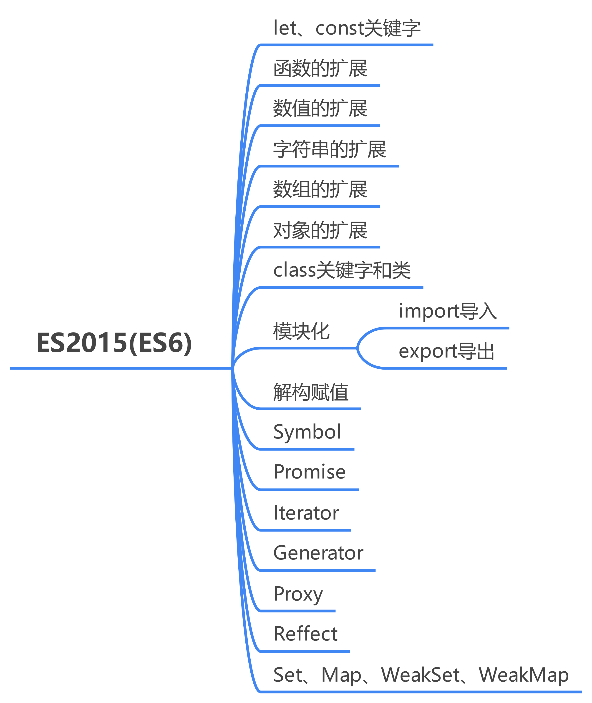
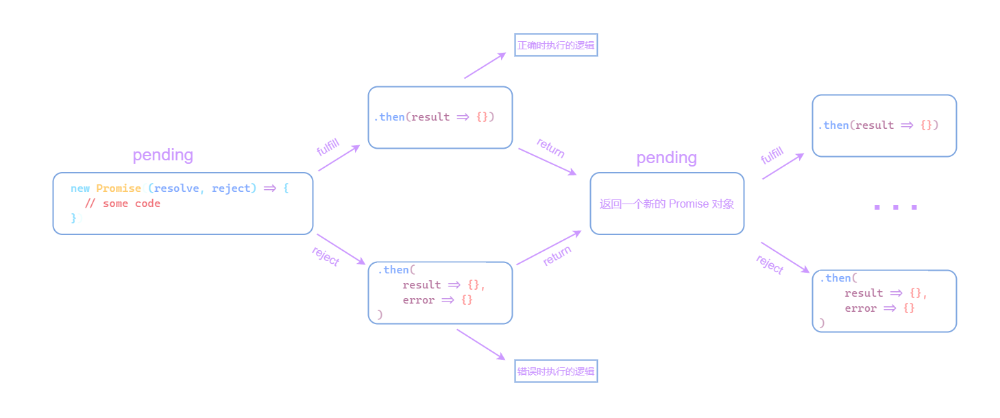
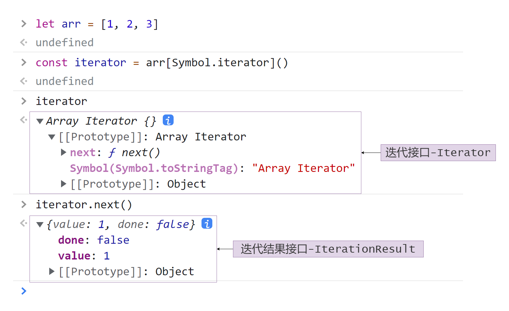
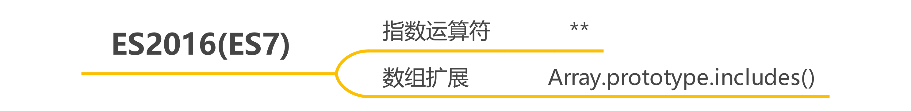
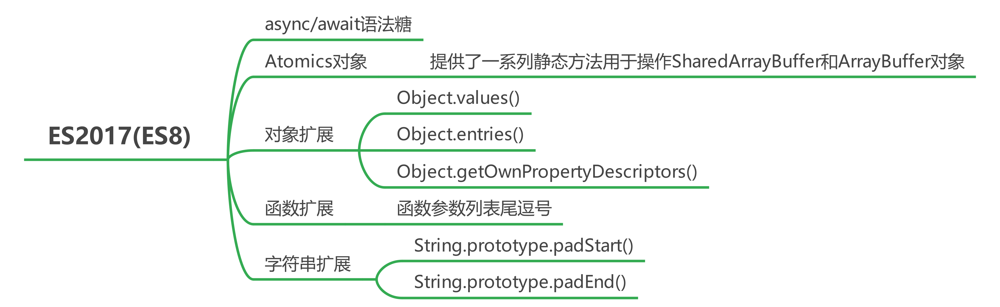
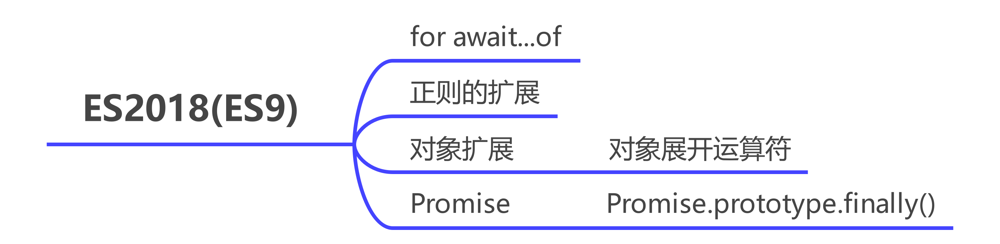
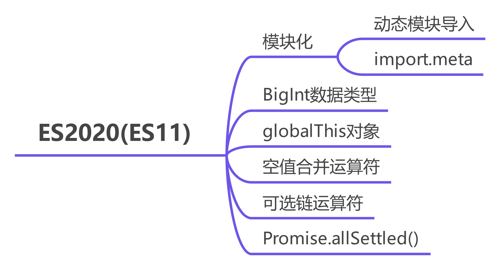
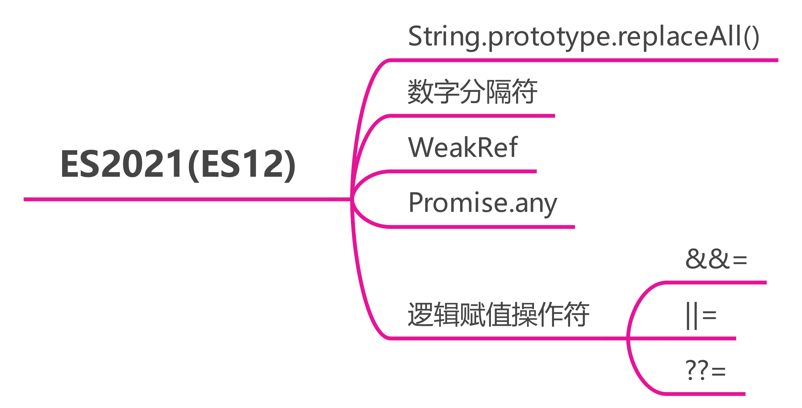

# ES6\~ES13的新特性

## 🍇 写在前面

自从ECMAScript在2015年正式发布了ES6起，到现在已经有了8个年头了，而自从2015年起，每年的6月都会发布一个新的版本，以当时的年作为版本号。

在这众多的版本中已经出现了很多新特性，为了方便记忆，我将所有的新特性全部整理在这一篇文章中。

> ps：有的资料称ES2015后的所有版本统称为ES6，也有的称ES6表示ES2015，ES7表示ES2016以此类推，这里不做讨论。

## 🍈 ES2015(ES6)

ES2015是改动最大的一个版本，基本上对ES2015之前的所有的内容都做了扩展，大体如下图所示：



### 🍉 let、const关键字和块级作用域

在ES6之前只有一种声明变量的方式，就是使用`var`关键字，在ES2015中**新增了********和****\*\*\*\*关键字来声明变量与常量**，代码如下：

```javascript
// 声明变量
let v = 100
v = 200
// 声明常量
const V = 200
// 修改常量
// V = 300 // 报错

```

同时**使用********和****\*\*\*\*关键字声明的变量或者常量是具有块级作用域的**，示例代码如下：

```javascript
{
  var v = 100
}
{
  let val = 200
}
console.log(v)
console.log(val) // 报错 val is not defined

```

值得注意的是**使用********或者****\*\*\*\*关键字声明的变量不具有变量提升的特性，且存在暂时性死区的特性。**

### 🍊 函数的扩展

在ES2015中**允许函数使用默认值**，示例代码如下：

```javascript
// es2015之前
function foo(v) {
  v = v ? v : 100
  return v
}

// es2015
function bar(v = 100) {
  return v
}

```

值得注意的是**如果有多个参数时，默认参数必须从后向前使用**。

**在ES2015中新增了箭头函数**，这是函数的一种简写形式，示例代码如下：

```javascript
function foo(v) {
  return v``
}
// 箭头函数写法
const foo = (v) => {
  return v
}
// 简写形式 1
const foo = v => { // 只有一个参数可以省略括号
  return v
}
// 简写形式 2
const foo = v => v // 语句中只有return时可以省略return和花括号

```

值得注意的是**箭头函数的********是根据执行上下文决定的，内部并不会绑定******。

**使用箭头函数时内部并不存在arguments对象，而是采用剩余参数的方式代替**，示例代码如下：

```javascript
const foo = (...args) => {
  // console.log(arguments) // ReferenceError: arguments is not defined
  console.log(args) // args 是一个数组
}
foo(1, 2, 3, 4) // [ 1, 2, 3, 4 ]


```

**在ES2015中为函数增加的要给name属性，该属性指向函数的名称**，示例代码如下：

```javascript
function foo(v) {
  return v
}
const bar = v => v
console.log(foo.name) // foo
console.log(bar.name) // bar

```

### 🍋 数值的扩展

在ES2015中对数值的扩展主要时为`Math`和`Number`两个对象增加一些方法，以及二进制和八进制的表示方法。

**在ES2015中使用********或者****\*\*\*\*表示二进制，使用**\*\*****或者****\*\*\*\*表示八进制。\*\*示例代码如下：

```javascript
console.log(0b111111111 === 511) // true
console.log(0o777 === 511) // true

```

为Number扩展的属性和方法如下：

| 属性/方法名                    | 描述             |
| ------------------------- | -------------- |
| Number.EPSILON            | 数值最小精度         |
| Number.MIN\_SAFE\_INTEGER | 最小安全数(`-2^53`) |
| Number.MAX\_SAFE\_INTEGER | 最大安全数(`2^53`)  |
| Number.parseInt()         | 把参数解析为整数并返回    |
| Number.parseFloat()       | 把参数解析为浮点数并返回   |
| Number.isFinite()         | 判断是否为有限数值      |
| Number.isNaN()            | 判断是否为NaN       |
| Number.isInteger()        | 判断是否为整数        |
| Number.isSafeInteger()    | 判断数值是否在安全范围内   |

为Math扩展的方法如下：

| 方法名          | 描述                                                                                   |
| ------------ | ------------------------------------------------------------------------------------ |
| Math.trunc() | 返回数值整数部分                                                                             |
| Math.sign()  | 返回数值类型(`正数1、负数-1、零0`)                                                                |
| ...          | 还有好多关于数学的方法【[查看](https://www.bookstack.cn/read/es6-3rd/spilt.7.docs-number.md "查看")】 |

### 🍌 字符串的扩展

ES2015引入**模板字符串，使用反引号(\`)定义，模板字符串会保留格式，且可以使用变量**，示例代码如下：

```javascript
// 使用 ` 定义模板字符串
let str = `一碗周`

// 模板字符串可以保留格式
let str2 = `一
碗
周`

// 模板字符串可以使用变量
const myName = '一碗周'
let str3 = `author: ${myName}` // 使用 ${} 进行包裹

```

ES2015还为String和String的示例扩展了一些方法，如下：

| 方法名                            | 描述                                          |
| ------------------------------ | ------------------------------------------- |
| String.fromCodePoint()         | 用于从 Unicode 码点返回对应字符                        |
| String.raw()                   | 返回一个斜杠都被转义（即斜杠前面再加一个斜杠）的字符串，往往用于模板字符串的处理方法。 |
| String.prototype.codePointAt() | 返回字符对应码点(`String.fromCodePoint()`的逆操作)      |
| String.prototype.normalize()   | 把字符的不同表示方法统一为同样形式，返回`新字符串`(Unicode正规化)      |
| String.prototype.repeat()      | 把字符串重复n次，返回处理后的字符串                          |
| String.prototype.includes()    | 判断是否存在指定字符串                                 |
| String.prototype.startsWith()  | 判断字符串是否存在原始字符串的头部                           |
| String.prototype.endsWith()    | 判断字符串是否存在原始字符串的尾部                           |

### 🍍 数组的扩展

**在ES2015中提供了展开运算符，即**\*\*\*\*\*\*，在数组中使用可以将数组展开，并以逗号分隔\*\*，示例代码如下：

```javascript
const arr = [1, 2, 3, 4, 5, 6]
const newArr = [...arr] // 复制数组

console.log(Math.max.call(null, ...arr)) // 将数组中的每一项作为参数使用

```

除此之外，还为Array以及数组提供了一系列方法，来逐个介绍：

*   `Array.from()`：将类数组对象或者可迭代对象创建为一个新的数组，示例代码如下：

    ```javascript
    function foo() {
      return Array.from(arguments) // 将 arguments 转换为数组
    }

    console.log(foo(1, 2, 3, 4, 5, 6)) // [ 1, 2, 3, 4, 5, 6 ]

    ```

*   `Array.of()`：创建一个具有可变数量参数的新数组实例，示例代码如下：

    ```javascript
    Array.of(1) // [1]
    Array.of(true, 1, '一碗周') // [true, 1, '一碗周']

    ```

*   `Array.prototype.copyWithin()`，浅复制数组的一部分到同一数组中的另一个位置，并返回它，不会改变原数组的长度。示例代码如下：

    ```javascript
    const arr = [1, 2, 3, 4]

    // 从索引 2 开始，到结束 将内容复制到索引 0 的位置
    arr.copyWithin(0, 2) // [ 3, 4, 3, 4 ]
    ```

*   `Array.prototype.find()`，根据给定的回调函数，找到匹配的第一个元素，找不到返回`undefined`，示例代码如下：

    ```javascript
    const arr = [1, 2, 3, 4]

    arr.find(item => item === 2) // 2（表示元素）、
    ```

*   `Array.prototype.findIndex()`，根据给定的回调函数，找到匹配的第一个元素的索引，找不到返回`-1`，示例代码如下：

    ```javascript
    const arr = [1, 2, 3, 4]

    arr.findIndex(item => item === 2) // 1 (表示索引)
    ```

*   `Array.prototype.fill()`，将给定值填充数组，示例代码如下：

    ```javascript
    const arr = [1, 2, 3, 4]
    // 将给定值填充索引1-3
    arr.fill('一碗周', 1, 3) // [ 1, '一碗周', '一碗周', 4 ]
    ```

*   `Array.prototype.keys()`，返回一个可迭代的对象，其内容为数组的`key`，示例代码如下：

    ```javascript
    const arr = [1, true, '一碗周']
    const keys = arr.keys()
    for (const i of keys) {
      console.log(i) // 遍历结果 0 1 2
    }
    ```

*   `Array.prototype.values()`，返回一个可迭代的对象，其内容为数组的`value`，示例代码如下：

    ```javascript
    const arr = [1, true, '一碗周']
    const values = arr.values()
    for (const i of values) {
      console.log(i) // 遍历结果 1 true 一碗周
    }
    ```

*   `Array.prototype.entries()`，返回一个可迭代的对象，其内容是一个数组，索引`0`为原数组的元素，`1`为原数组该位置的值，示例代码如下：

    ```javascript
    const arr = [1, true, '一碗周']

    const iterator = arr.entries()
    console.log(Array.from(iterator)) // [ [ 0, 1 ], [ 1, true ], [ 2, '一碗周' ] ]
    ```

### 🥭 对象的扩展

ES2015中**允许对象的属性名和属性值一致时可以只写属性名**，示例代码如下：

```javascript
const myName = '一碗周'
const age = 18
const person = { myName, age }
console.log(person) // { myName: '一碗周', age: 18 }

```

还有就是**在定义对象时，允许使用**\*\*\*\***包裹表达式作为属性名**，示例代码如下：

```javascript
const myName = '一碗周'
const age = 18
const person = {
  myName,
  ['a' + 'g' + 'e']: age,
}
console.log(person) // { myName: '一碗周', age: 18 }

```

*   `Object.is()`：用于比较两个值是否相等，用于解决`NaN ≠= NaN`，`+0 === -0`的问题，示例代码如下：

    ```javascript
    console.log(NaN === NaN) // false
    console.log(+0 === -0) // true

    console.log(Object.is(NaN, NaN)) // true
    console.log(Object.is(+0, -0)) // false


    ```

*   `Object.assign()`：将所有可枚举属性的值从一个或多个源对象复制到目标对象，并返回目标对象，示例代码如下：

    ```javascript
    const person = Object.assign({}, { name: '一碗周' }, { age: 18 })
    console.log(person) // { name: '一碗周', age: 18 }

    ```

*   `Object.getPrototypeOf()`：获取原型对象；

*   `Object.setPrototypeOf()`：设置原型对象。

### 🍎 类

在ES2015中提出了类的概念，在语法的层面上有了类，示例代码如下：

```javascript
class Person {
  constructor(age) {
    // 属性
    this.myName = '一碗周'
    this.age = age
  }
  // 静态方法
  static print() {
    console.log()
  }
  // 访问器
  get myName() {
    console.log('getter')
    return '一碗周'
  }
  set myName(v) {
    console.log('setter' + v)
  }
  setName(v) {
    this.myName = v
  }
}
const person = new Person(18)
person.setName('ywanzhou') // 触发 setter 访问器
console.log(person.myName) // 触发 getter 访问器

```

### 🍏 模块化

在ES2015中提出ESModel模块化规范，这是第一个官方层面的模块化规范，在这个规范中**允许我们使用********导出模块，使用****\*\*\*\*引入模块**，示例代码如下：

```javascript
import a from 'm' // 导入模块 m 中的默认导出，将其命名为 a
import a, { b } from 'm' // 导入模块 m 中的默认导出以及单独导入成员 b
import * as A from 'm' // 导入模块中的所有成员
import 'm' // 执行 m 模块

export const b = 1 // 单独导出
export default b // 默认导出
export { b } // 按需导出
export { b as bb } // 改名导出

export { b } from 'm' // 导入模块 m 中的成员 b 并导出

```

### 🍐 解构赋值

ES2015新增了**解构赋值**的语法，**允许我们使用按照一定的模式，在数组或者对象中提取指定的值**，示例代码如下：

```javascript
// 数组的解构赋值
let [name, age, hobby = 'coding' /* 结构赋值的默认值 */] = ['一碗周', 18]
// 交换两个变量的值
let a = 1
let b = 2
;[a, b] = [b, a]
console.log(a, b) // 2 1

// 对象的结构赋值
let { name: ObjName /* 解构赋值重命名 */, sex } = { name: '一碗周', sex: 1 }

// 函数参数的解构赋值
function bar({ name, age }) {
  return name + age
}
bar({ name: '一碗周', age: 18 }) // 一碗周18


```

### 🍑 Symbol

Symbol是ES2015中新增的一种数据类型，通过`Symbol()`方法创建，可以传递一个字符串作为参数，用于描述该Symbol；

通过`Symbol()`方法创建的symbol值都是唯一的，示例代码如下：

```javascript
/**
 * 语法
 * Symbol([description])
 * * description -> 是一个可选的描述信息
 */
// 创建一个 Symbol 类型的值
const mySymbol = Symbol()
console.log(mySymbol) // Symbol()

const myName = Symbol('一碗周')
console.log(typeof myName) // symbol

```

Symbol还有一系列属性和方法这里就不作介绍了。

### 🍒 Promise

**Promise是ES2015中提供的一个异步解决方案，解决了回调地狱的问题。**

通过`Promise()`构造函数可以创建一个promise对象，每一个Promise对象都具有以下几种状态：

*   *pending*: 初始状态，既不是成功，也不是失败状态。

*   *resolved*: 意味着操作成功完成。

*   *rejected*: 意味着操作失败。

状态的切换只有两种，分别是：

*   *pending*→*resolved*

*   *pending*→*resolved*

**一旦状态发生改变，就不会再次改变**

`Promise`实例中存在要给`then`方法，允许我们在`Promise`实例中**链式调用**，每个`then`方法还会返回一个`Promise`实例，如下图所示



示例代码如下：

```javascript
new Promise((resolve, reject) => {
    console.log('我是第一个Promise中的log')
    resolve()
})
    .then(() => {
        console.log('我是第一个then中的log')
    })
    .then(() => {
        console.log('我是第二个then中的log，但是我出现了异常')
        throw new Error('Error')
    })
    .then(() => {
        console.log('我是第三个then中的第一个回调的log，但是我不会执行，因为我上面出现了异常')
    }, () => {
        console.log('我是第三个then中的第二个回调的log，我执行了')
    })
    .then(() => {
        console.log('我是第四个then中的log，我可以正常执行')
    })

/* 执行结果如下
我是第一个Promise中的log
我是第一个then中的log
我是第二个then中的log，但是我出现了异常
我是第三个then中的第二个回调的log，我执行了
我是第四个then中的log，我可以正常执行
*/
```

有关`Promise`的一些方法如下：

*   `Promise.prototype.then()`：它最多需要有两个参数：Promise的成功和失败情况的回调函数；

*   `Promise.prototype.catch()`：等于`then`方法的第二个参数；

*   `Promise.all()`：将多个实例包装成一个新实例，返回全部实例状态变更后的结果数组(齐变更再返回)

*   `Promise.race()`：将多个实例包装成一个新实例，返回全部实例状态优先变更后的结果(先变更先返回)

*   `Promise.resolve()`：将对象转为Promise对象(等价于`new Promise(resolve => resolve())`)

*   `Promise.reject()`：将对象转为状态为`rejected`的Promise对象(等价于`new Promise((resolve, reject) => reject())`)

### 🍓 Iterator

Iterator即迭代器，它是一种接口，为**各种不同的数据结构提供了统一的访问机制**，换句话说，只要有任何数据结构部署了迭代接口，就可以使用统一的方式的来遍历它。

实现可迭代接口的数据结构，一般都自身实现或继承了以`Symbol.iterator`属性的，就属于可迭代对象。`Symbol.iterator`属性本身是一个函数，就是当前数据结构默认的遍历器生成函数。

一个包含`next()`方法的对象，才可以称为一个迭代对象。`next()`对象的会有返回一个对象，对象中包含两个值，如下所示：

*   `value`：迭代器返回的任何`JavaScript`值。`done`为`true`时可省略。

*   `done`：一个布尔值，为`false`时表示迭代未停止，为`true`时立即停止迭代器，且可以省略`value`的值。

JavaScript原生提供的迭代器接口如下图所示：



现在我们为`obj`来实现一个迭代器，代码如下：

```javascript
const obj = {
    [Symbol.iterator] () {
        return {
            next () {
                console.log('迭代器执行了');
                return {
                    value: '',
                    done: true // 标志是否结束，true表示已经结束
                }
            }
        }
    }
}
```

我们在`next()`方法中添加了一个打印，为了验证迭代器执行了，最终的运行结果为

```纯文本
迭代器执行了
```

### 🫐 Generator

Generator是ES2015中提供的一种**异步编程解决方案**，定义Generator函数在`function`关键字和函数名中间使用`*`星号，函数内部使用`yield`关键字定义不同的状态。

示例代码如下：

```javascript
function* testGenerator() {
  // yield定义一个状态
  yield '一碗周'
  yield 'es新特性'
  return 'generator' // 终结Generator，后面即使有yield关键字也无效
}
const g = testGenerator() // 返回 Generator 对象，通过next()方法移动状态

g.next()
/* { value: '一碗周', done: false } */

g.next()
/* { value: 'es新特性', done: false } */

g.next()
/* { value: 'generator', done: true } */

```

### 🍈 Proxy和Reffect

Proxy对象用于创建一个代理对象，从而实现基本操作的拦截和自定义，基本操作包含13种，如下表所示：

| 拦截 ⽅法                                       | 触发⽅式                                                                             |
| ------------------------------------------- | -------------------------------------------------------------------------------- |
| `get(target, propKey, receiver)`            | 读取某个属性                                                                           |
| `set(target, propKey, value, receiver)`     | 写⼊某个属性                                                                           |
| `has(target, propKey)`                      | `in`操作符                                                                          |
| `deleteProperty(target, propKey)`           | `delete`操作符                                                                      |
| `getPrototypeOf(target)`                    | `Object.getPropertypeOf()`                                                       |
| `setPrototypeOf(target, proto)`             | `Object.setPrototypeOf()`                                                        |
| `isExtensible(target)`                      | `Object.isExtensible()`                                                          |
| `preventExtensions(target)`                 | `Object.preventExtensions()`                                                     |
| `getOwnPropertyDescriptor(target, propKey)` | `Object.getOwnPropertyDescriptor()`                                              |
| `defineProperty(target, propKey, propDesc)` | `Object.defineProperty()`                                                        |
| `ownKeys(target)`                           | `Object.keys()` 、`Object.getOwnPropertyNames()`、`Object.getOwnPropertySymbols()` |
| `apply(target, thisArg, args)`              | 调⽤⼀个函数                                                                           |
| `construct(target, args)`                   | ⽤ new 调⽤⼀个函数                                                                     |

Vue3就是基于`Proxy`进行编写的，下面这段代码展示了`Proxy`对象的使用：

```html
<!DOCTYPE html>
<html lang="en">

<head>
  <meta charset="UTF-8" />
  <meta http-equiv="X-UA-Compatible" content="IE=edge" />
  <meta name="viewport" content="width=device-width, initial-scale=1.0" />
  <link href="https://cdn.bootcdn.net/ajax/libs/twitter-bootstrap/5.0.2/css/bootstrap.min.css" rel="stylesheet" />
  <title>通过set自动更新dom</title>
</head>

<body>
  <div class="card" style="width: 300px; margin: 100px auto">
    <div class="card-body">
      <h1 id="name"></h1>
      <button id="btn" class="btn btn-primary">修改</button>
    </div>
  </div>
  <script>
    // 获取DOM节点
    const name = document.getElementById('name')
    const btn = document.getElementById('btn')
    // 定义一个修改值的函数
    const updateDOM = (el, value) => {
      el.innerHTML = value
    }
    const person = new Proxy({
      name: '一碗粥',
    }, {
      set(target, propKey, value) {
        // 如果里面的值改变就去调用我们的updateDOM
        updateDOM(name, value)
        target[propKey] = value
        return true
      },
    })
    name.innerHTML = person.name

    // 点击按钮触发修改操作
    btn.addEventListener('click', () => {
      person.name === '一碗周' ?
        (person.name = '一碗粥') :
        (person.name = '一碗周')
    })
  </script>
</body>

</html>
```

上面的代码就利用set方法进行数据绑定，如果对象发生改变，就自动更新我们的DOM。

Reflect是ECMAScript2015提供的一个对象，它**提供了一些拦截JavaScript操作的静态方法**，这些方法与Proxy中的`handlers`中的方法一致。

Reflect并不是一个构造函数，也就是说它不能够被实例化。

`Proxy`对象中的每一个拦截操作（例如：`get`、`delete`等）,内部都对应的调用了`Reflect`的方法。它提供的静态方法与Proxy中的`handlers`中的方法名称都一致，具体如下：

| 默认调⽤                                 | 功能                           |
| ------------------------------------ | ---------------------------- |
| `Reflect.get()`                      | 获取对象身上某个属性的值                 |
| `Reflect.set()`                      | 在对象上设置属性                     |
| `Reflect.has()`                      | 判断一个对象是否存在某个属性               |
| `Reflect.deleteProperty()`           | 删除对象上的属性                     |
| `Reflect.getPrototypeOf()`           | 获取指定对象原型的函数                  |
| `Reflect.setPrototypeOf()`           | 设置或改变对象原型的函数                 |
| `Reflect.isExtensible()`             | 判断一个对象是否可扩展 （即是否能够添加新的属性）    |
| `Reflect.preventExtensions()`        | 阻止新属性添加到对象                   |
| `Reflect.getOwnPropertyDescriptor()` | 获取给定属性的属性描述符                 |
| `Reflect.defineProperty()`           | 定义或修改一个对象的属性                 |
| `Reflect.ownKeys()`                  | 返回由目标对象自身的属性键组成的数组           |
| `Reflect.apply()`                    | 对一个函数进行调用操作，同时可以传入一个数组作为调用参数 |
| `Reflect.construct()`                | 对构造函数进行 `new`操作，实现创建类的实例     |

### 🍉 Set、Map、WeakSet、WeakMap

`Set`、`Map`、`WeakSet`、`WeakMap`是ES2015中新增的几个对象：

*   `Set`和`WeakSet`与数组类似，准确的它他们是集合，这两者的区别就是`Set`**可以存储任何数据类型**，而`WeakSet`**只能存储对象的引用，而且是弱引用**；

    `Set`对象在实际开发中最常见的就是实现数据去重，示例代码如下：

    ```javascript
    const arr = [1, 2, 2, 3, 4, 3, 5]
    const set = new Set(arr)
    // set对象可以使用 ... 展开 所有项
    console.log([...set]) // [ 1, 2, 3, 4, 5 ]

    ```

*   `Map`和`WeakMap`与对象类似，存储方式是键值对形式的，这两者的区别`Map`的键值对都是可以是任意的而`WeakMap`键必须是对象的引用而值可以是任意类型的。

## 🍊 ES2016(ES7)

ES2016发布的新特性比较少，主要就两个新特性，如下图所示：



### 🍋 指数运算符

ES2016中新增指数`**`，也叫幂运算符，与Math.pow()有着一样的功能，示例代码如下：

```javascript
console.log(2 ** 10 === Math.pow(2, 10)) // true

```

### 🍌 Array.prototype.includes()方法

在ES2016中在数组原型上增加了`includes()`方法，该方法用于判断一个数组中是否包含指定的值，返回一个布尔值，示例代码如下：

```javascript
const arr = [1, 2, 3, 4, 5, NaN]
console.log(arr.indexOf(NaN)) // -1
console.log(arr.includes(NaN)) // true

```

值得注意的是**使用********时****\*\*\*\*与**\*\*\*\*\*\*、********与********是相等的。\*\*

## 🍍 ES2017(ES8)



### 🥭 async/await语法糖

Promise的出现虽然解决了回调地狱的问题，但是如果链式调用特别多的话可读性还是会变差，在ES2017中新增了 async/await语法糖解决了这个问题。

Promise的写法如下：

```javascript
;(function () {
  function promise(v) {
    return new Promise((resolve, reject) => {
      resolve(v)
    })
  }
  const p = promise(1)
  p.then(res => {
    return promise(res)
  }).then(res => {
    console.log(res)
  })
})()


```

如果下一个Promise依赖于上一个，这种链式调用就会非常的长，现在我们用 async/await语法糖改写一下：

```javascript
;(async function () {
  function promise(v) {
    return new Promise((resolve, reject) => {
      resolve(v)
    })
  }
  const r1 = await promise(1)
  const r2 = await promise(r1)
  const res = await promise(r2)
  console.log(res)
})()

```

可以看到，我们可以利用 async/await语法糖将Promise改写为平级的写法。

### 🍎 Atomics对象

ES2017中新增了Atomics对象，该对象提供了一系列静态方法用于操作[SharedArrayBuffer](https://developer.mozilla.org/zh-CN/docs/Web/JavaScript/Reference/Global_Objects/SharedArrayBuffer "SharedArrayBuffer")和[ArrayBuffer](https://developer.mozilla.org/zh-CN/docs/Web/JavaScript/Reference/Global_Objects/ArrayBuffer "ArrayBuffer")对象，该对象并不能使用`new`关键字进行实例化，仅仅提供了一些静态的属性和方法

### 🍏 对象扩展

在ES2017中为`Object`扩展了三个静态方法，如下所示：

*   `Object.values()`：返回一个给定对象自身的所有可枚举属性值的数组；

*   `Object.entries()`：返回一个给定对象自身可枚举属性的键值对数组；

*   `Object.getOwnPropertyDescriptors()`：返回给定对象所有自有属性的属性描述符。

### 🍑 函数扩展

**在ES2017中允许我们在函数参数列表的最后面添加逗号**，这个小特性非常的有用，因为为尾逗号的更新的时候仅仅需要改动一行代码，如果不适用尾逗号则是改动两行代码。实例代码如下：

```javascript
function fun(
  aaaaa,
  bbbbb,
  ccccc,
) {}

```

如果存在尾逗号，只需要在最后面添加一行就好；如果不存在则需要在后面添加要给逗号，然后在添加一行。这在版本管理中就改动了两行，而不是一行。

### 🍒 字符串扩展

在ES2017中为字符串新增了两个实例方法，分别是：

*   `padStart()`：在字符串开头填充空格；

*   `padEnd()`：在字符串结尾填充空格；

示例代码如下：

```javascript
const str = '一碗周'

console.log(str.padStart(10)) /*        一碗周 */
console.log(str.padEnd(10))   /* 一碗周        */

```

## 🍓 ES2018(ES9)



### 🫐 异步迭代

在ES2018中新增了`for await...of`语句，该用于可以遍历异步可迭代对象，示例代码如下：

```javascript
var asyncIterable = {
  [Symbol.asyncIterator]() {
    return {
      i: 0,
      next() {
        if (this.i < 3) {
          return Promise.resolve({ value: this.i++, done: false })
        }

        return Promise.resolve({ done: true })
      },
    }
  },
}

;(async function () {
  for await (num of asyncIterable) {
    console.log(num)
  }
})()

// 0
// 1
// 2

```

### 🍈 正则的扩展

在ES2018中，对正则表达式进行了如下扩展：

1.  **正则表达式分组命名**：

    在ES2018之前，我们无法对正则表达式中的分组命名，在ES2018中引入了该特性，该特性既方便了正则的阅读又方便了引用，示例代码如下：

    ```javascript
    const RE_DATE = /(?<year>\d{4})-(?<month>\d{2})-(?<day>\d{2})/

    const matchObj = RE_DATE.exec('2022-02-22')
    const year = matchObj.groups.year // 2022
    const month = matchObj.groups.month // 02
    const day = matchObj.groups.day // 22

    ```

2.  s修饰符/dotALl模式

    新增的s修饰符允许使用`.`匹配任意单个字符，\*\*\*\*属性表明是否在正则表达式中一起使用"`s`"修饰符。

3.  反向断言

    ES2018之前仅存在正向断言，而ES2018中新增了**反向断言**和**反向否定断言**。

### 🍉 对象展开运算符

ES2015中新增数组的展开运算符，在ES2018中将这一特性加入到了对象中，示例代码如下：

```javascript
const n = { name: '一碗周' }
const a = { age: 18 }
const person = { ...n, ...a }
// 合并对象
console.log(person) // { name: '一碗周', age: 18 }

```

### 🍊 Promise.prototype.finally()

`finally()`方法会返回一个`Promise`对象，当promise的状态变更，不管是变成`rejected`或者`fulfilled`，最终都会执行`finally()`的回调。

示例代码如下：

```javascript
fetch(url)
  .then(res => {
    console.log(res)
  })
  .catch(error => {
    console.log(error)
  })
  .finally(() => {
    console.log('结束')
  })


```

## 🍋 ES2019(ES10)


### 🍌 优化

在ES2019中优化了以下两个内容：

*   `Function.prototype.toString()`：返回的函数体包含注释与空格；

*   `try...catch`：语句中的`catch`允许不使用参数，示例代码如下：

    ```javascript
    try {
      console.log('一碗周')
    } catch {
      console.error('一碗周')
    }

    ```

### 🍍trimStart()/trimLeft()和trimEnd()/trimRight()&#x20;

*   `String.prototype.trimStart`：用于去除字符串左边的空格；

*   `String.prototype.trimLeft`：它是`trimStart`的别名

*   `String.prototype.trimEnd`：用于去除字符串右边的空格；

*   `String.prototype.trimRight`：它是`trimEnd`的别名

### 🥭 数组的扩展

在ES2019中扩展了两个数组方法，分别是：

*   `Array.prototype.flat()`：该方法会按照一个可指定的深度递归遍历数组，并将所有元素与遍历到的子数组中的元素合并为一个新数组返回；简单的说就是**实现数组的扁平化**。

    ```javascript
    const arr = [0, 1, 2, [3, 4]]
    console.log(arr.flat()) // [ 0, 1, 2, 3, 4 ]

    ```

*   `Array.prototype.flatMap()`：该方法映射且扁平化数组，返回新数组(只能展开一层数组)。

### 🍎 Object.fromEntries()

ES2019中新增的`Object.fromEntries()`方法把键值对列表转换为一个对象，是`Object.entries()`方法的反操作，示例代码如下：

```javascript
const person = {
  name: '一碗周',
  age: '18',
}
const e = Object.entries(person)

const p = Object.fromEntries(e)
console.log(p) // { name: '一碗周', age: '18' }

```

### 🍏Symbol.prototype.descrption

`description`是一个只读属性，它会返回创建Symbol对象时的那个可选的描述字符串。

## 🍑ES2020(ES11)



### 🍒 模块化

在ES2020中加入了**动态导入**，也就是我们需要该模块的时候才会进行加载，这可以减少开销和页面加载时间，示例代码如下：

```javascript
import('/modules/my-module.js').then(module => {
  // Do something with the module.
})

```

动态导入使用`import()`方法，它返回一个Promise。

**在ES2020中，还为********增加一个****\*\*\*\*对象，该对象给JavaScript模块暴露了特定上下文的元数据属性的对象。**

### 🍓 BigInt数据类型

BigInt的出现时解决JavaScript中允许的最大数字是`2**53-1`的问题，\*\*\*\* 可以表示任意大的整数。

```javascript
const theBiggestInt = 9007199254740991n;

const alsoHuge = BigInt(9007199254740991);
// ↪ 9007199254740991n

const hugeString = BigInt("9007199254740991");
// ↪ 9007199254740991n

const hugeHex = BigInt("0x1fffffffffffff");
// ↪ 9007199254740991n

const hugeBin = BigInt("0b11111111111111111111111111111111111111111111111111111");
// ↪ 9007199254740991n
```

### 🫐 globalThis对象

ES2020中引入`globalThis`，它是对全局对象的引入，在Node是的全局对象是`Global`，而浏览器环境是`Window`；如下代码展示的在有没有`GlobalThis`的区别：

```javascript
// 之前
var getGlobal = function () { 
  if (typeof self !== 'undefined') { return self; } 
  if (typeof window !== 'undefined') { return window; } 
  if (typeof global !== 'undefined') { return global; } 
  throw new Error('unable to locate global object'); 
}; 

var globals = getGlobal(); 

if (typeof globals.setTimeout !== 'function') { 
  // no setTimeout in this environment! 
}
```

```javascript
// 之后

if (typeof globalThis.setTimeout !== 'function') {
  // no setTimeout in this environment!
}

```

### 🍈 空值合并运算符

空值合并运算符是由两个问号来表示，该运算符也是一个逻辑运算符，该运算符与逻辑或运算符类似。其计算规则为，只要左运算元为`null`或者`undefined`，则返回右运算元，否则返回左运算元。而逻辑或运算符只有左运算元转换为`boolean`类型后为`false`，就返回右运算元。

示例代码如下：

```javascript
console.log(null ?? 10) // 10
console.log(undefined ?? 10) // 10
console.log(false ?? 10) // false
```

该运算符用于为没有值的变量赋值很有用，例如：如果这个数没有值，就为其赋值，否则不赋值，示例代码如下：

```javascript
var value

// 如果value的值不为 null 或者 undefined 为其赋值10
value = value ?? 10
console.log(value) // 10
```

> 值得注意的是**空值合并运算符**与**逻辑与和逻辑或不能同时使用**，否则会抛出异常，解决方案是通过使用`()`来表明优先级

### 🍉可选链操作符

可选链操作符用于读取某对象链下深处属性的值，使用这个操作符不必验证对象下的每个属性必须存在，例如我们想要访问`A.a.b`这个属性时，我们首先需要确保`A`存在，然后需要确保`A.a`存在，才可以访问`A.a.b`这个属性，不然就会报错。

使用可选链操作符就不会出现这样的问题，当我们访问某个属性时，只要有一处不存在，就会返回`undefind`，不会报错。

```javascript
var A = {}

// console.log(A.a.b) // 报错

console.log(A.a?.b) // undefined
```

可选链操作符也可用于对象下方法的调用，示例代码如下：

```javascript
var obj = {}

// 如果存在 obj.fun() 这个方法，下面则会直接调用，如果不存在则会返回undefined
obj.fun?.A()
```

### 🍊 Promise.allSettled()

`Promise.allSettled()`方法返回一个在所有给定的 promise 都已经resolved或rejected后的 promise，并带有一个对象数组，每个对象表示对应的 promise 结果。

## 🍋 ES2021(ES12)



### 🍌 String.prototype.replaceAll()

\*\*\*\*方法返回一个新字符串，新字符串的内容是经过替换的，实例代码如下：

```javascript
const str = '一碗粥'
const newStr = str.replaceAll('粥', '周')
console.log(newStr) // 一碗周

```

### 🍍 数值分隔符

严格意义上讲数值分隔符(`_`)并不属于一个运算符，其作用就是使数字更加利于阅读，例如下面的代码

```javascript
console.log(1_0000_0000) // 100000000
```

这个符号仅仅起到了便于阅读的目的，有与没有的结果并不影响，看下面的代码

```javascript
1_1 === 11 // true
```

### 🥭 WeakRef

ES2021中新增的`WeakRef`对象允许您保留对另一个对象的弱引用，而不会阻止被弱引用对象被GC回收。

### 🍎 Promise.any()

ES2021中新增的`Promise.any()`方法，它接受的参数和与`promise.all()`是一致的，唯一不同的是，`Promise.any()`方法接受的可迭代对象中没有一个promise成功（即所有的promises都失败/拒绝），就返回一个失败的promise和AggregateError类型的实例。

### 🍏 逻辑赋值操作符

ES2021中新增了一些赋值运算符，具体如下：

*   `&&=`

*   `||=`

*   `??=`

实际上它与普通的赋值运算符一致，示例代码如下：

```javascript
const [f1, f2, f3] = [true, false]
f1 &&= '一碗周' // 等同于 str = str && '一碗周'
f2 ||= '一碗周' // 等同于 str = str || '一碗周'
f3 ??= '一碗周' // 等同于 str = str ?? '一碗周'

```

## 🍑 ES2022

### 🍒 class的扩展

在ES2022中允许我们并不在`constructor`中定义类的成员，示例代码如下：

```javascript
class C {
  myName = '一碗周'
}
/* 两者是一致的 */
class C {
  constructor() {
    myName = '一碗周'
  }
}

```

> 如果成员只声明不初始化它的默认值是undefined。

在ES2022中允许我们使用`#`开头命名的变量作为类的私有成员，示例代码如下：

```javascript
class C {
  #myName = '一碗周'
}
const c = new C()
console.log(#myName) //  Private field '#myName' must be declared in an enclosing class
```

### 🍓 await在顶层使用

在ES2022中新增了允许在顶层使用`await`，在顶层可以不适用`async`函数进行包裹，示例代码如下：

```javascript
import { AsyncFun } from 'module'
await AsyncFun()
console.log(123)

```

### 🫐 Object.hasOwn()

`Object.hasOwn()`方法用于**判断某个对象上是否具有某个属性**，示例代码如下：

```javascript
const person = {
  name: '一碗周',
  age: 18,
}
console.log(Object.hasOwn(person, 'name')) // true
console.log(Object.hasOwn(person, 'sex')) // false

```

### 🍈 Array.prototype.at()

ES2022中新增的`at()`方法，它的作用是**获取数组中的某个成员**，它的参数是数组的索引，与直接使用索引的方式不同，它**允许我们传递负值**，**等同于从后面倒数**，示例代码如下：

```javascript
const arr = [1, 2, 3, 4, 5, 6]
console.log(arr.at(-1)) // 6
// 等同于 arr[arr.length - 1]

```

### 🍉 d修饰符

正则表达式增加了一个`/d`修饰符，当使用正则表达式的`exec()`方法时，如果有`/d`修饰符，那么结果会多返回一个indices属性，用来表示匹配的结果的在原字符串中的起始index值。示例代码如下：

```javascript
const str = 'JavaScript'
const r = /a/d

const m = r.exec(str)
console.log(m.indices[0]) //[ 1, 2 ]

```

## 🍊 写在最后

这篇文章到这就结束了，这篇文章中整理了ES2015到ES2022的新特性，有可能会有疏漏，望谅解。

如果觉得有用就点赞收藏支持一下吧\~\~\~\~

脑图如下：


