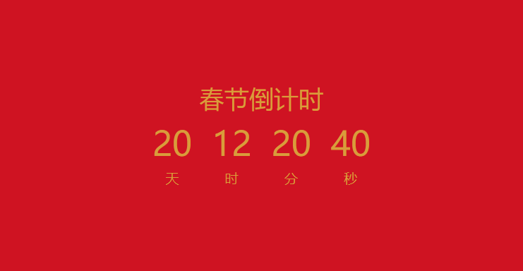

# 我用Vue3+TS实现了一个新年倒计时组件，适用于各种场景

## 写在前面

最近在写一个考试系统，有一个倒计时自动交卷的需求，正好也马上春节，就有了编写一个倒计时组件的想法。

对于这个倒计时组件，它应该具有这样的功能：

- 字体、颜色等样式可以由使用者自定义；
- 结束时间也可以由使用者自定义；
- 倒计时结束以后，倒计时组件`emit`一个事件，以便进行后续操作。

现在我们根据这样的需求，去编写这个组件。

## 组件属性和事件

首先我们创建一个Vue3+TS+setup的基础组件，代码如下：

```HTML
<template>
  <div></div>
</template>
<script setup lang="ts">
import { onMounted, ref } from 'vue'
onMounted(() => {
  console.log('mounted!')
})
</script>
<style scoped></style>

```


然后定义组件的props和emits，方便后续编写，定义的内容如下：

```JavaScript
interface Props {
  label?: string
  // 字体颜色和背景颜色，接收十六进制字符串
  textColor?: string
  backgroundColor?: string
  height?: string
  width?: string
  // 依次传递 label 时间 描述 的字体大小
  fontSize?: string[]
  mFontSize?: string[]
  // 结束时间，单位毫秒
  endTime?: number
}
const emit = defineEmits(['time-end'])
const props = withDefaults(defineProps<Props>(), {
  label: '春节倒计时',
  // 默认样式
  textColor: '#d99c3b',
  backgroundColor: '#cf1322',
  width: '100%',
  height: '100%',
  fontSize: () => {
    return ['2.2rem', '1.2rem', '3rem']
  },
  mFontSize: () => {
    return ['1.7rem', '0.8rem', '2rem']
  },
  // 2022年春节的时间戳，单位毫秒
  endTime: new Date(2022, 1, 1).getTime(),
})

```


这里我们使用了TS的类型约束，增加代码的健壮性。

## 静态效果

我们定义了内容之后，来编写一下静态效果，HTML骨架如下：

```HTML
<div class="middle">
  <h1 class="label">{{ props.label }}</h1>
  <div class="time">
    <span>
      <div>20</div>
      天
    </span>
    <span>
      <div>12</div>
      时
    </span>
    <span>
      <div>20</div>
      分
    </span>
    <span>
      <div>40</div>
      秒
    </span>
  </div>
</div>
```


在Vue3中，我们可以在`<style>`标签中使用`v-bind`指令，具体可以参考[单文件组件样式特性 | Vue.js (vuejs.org)](https://v3.cn.vuejs.org/api/sfc-style.html#状态驱动的动态-css)，我们的样式如下：

```CSS
.middle {
  display: flex;
  flex-direction: column;
  justify-content: center;
  height: v-bind('props.height');
  width: v-bind('props.width');
  text-align: center;
  user-select: none;
  background-color: v-bind('props.backgroundColor');
}
.label {
  font-size: v-bind('props.fontSize[0]');
  color: v-bind('props.textColor');
}

.time {
  color: v-bind('props.textColor');
  text-transform: uppercase;
  display: flex;
  justify-content: center;
}

.time span {
  padding: 0 14px;
  font-size: v-bind('props.fontSize[1]');
}

.time span div {
  font-size: v-bind('props.fontSize[2]');
}

@media (max-width: 740px) {
  .label {
    font-size: v-bind('props.mFontSize[0]');
  }
  .time span {
    padding: 0 16px;
    font-size: v-bind('props.mFontSize[1]');
  }
  .time span div {
    font-size: v-bind('props.mFontSize[2]');
  }
}
```


它最终是下面这个样子：



## 获取剩余时间

现在我们有了基础的样式以及需要的属性，然后我们需要获取一下距离`endTime`的剩余时间，这里我们采用`dayjs`中提供的`diff`方法（因为我在项目中引入了`day.js`，如果没有的话，可以用两个时间戳做加法，效果是一样的），这个方法可以返回指定两个时间的差异，使用方法如下：

```JavaScript
import dayjs from 'dayjs'
const timeLeft = ref(dayjs(props.endTime).diff(dayjs(Date.now()), 'seconds'))

```


返回`endTime`到现在的时间，单位是秒。

然后我们定义一个计算属性，来将这个秒格式化一下，示例代码如下：

```JavaScript
const durationFormatter = computed(() => {
  const time = timeLeft.value
  if (!time) return { ss: 0 }
  let t = time
  const ss = t % 60
  t = (t - ss) / 60
  if (t < 1) return { ss }
  const mm = t % 60
  t = (t - mm) / 60
  if (t < 1) return { mm, ss }
  const hh = t % 24
  t = (t - hh) / 24
  if (t < 1) return { hh, mm, ss }
  const dd = t
  return { dd, hh, mm, ss }
})
```


获取之后我们只需要在`<template>`使用我们的计算属性，从而动态的显示数据。

## 开始倒计时

最后，我们还剩一步，就是让这个时间动起来。这里我们采用`setTimeout`而不是`setInterVal`，实现代码如下：

```JavaScript
let timer: any = null
const getTime = () => {
  // 避免重复执行 setTimeout
  timer && clearTimeout(timer)
  timer = setTimeout(() => {
    if (timeLeft.value >= 0) {
      --timeLeft.value
      getTime() // 递归调用
    } else {
      emit('time-end', props.endTime)
    }
  }, 1000)
}
```


当倒计时结束后，将`time-end`事件emit到父组件，并将结束时间作为event参数。

## 使用组件

使用这个组件也比较简单，直接引入即可，代码如下：

```HTML
<template>
  <countDown width="100vw" height="100vh" @time-end="timeEnd"></countDown>
</template>
<script setup lang="ts">
import { countDown } from '@/components/countDown/index'
const timeEnd = (e: any) => {
  console.log(e)
}
</script>
<style scoped></style>

```


运行效果如下：


## 写在最后

以上就是这篇文章的全部内容，如果觉着俺写的不错，可以点个赞支持下。


