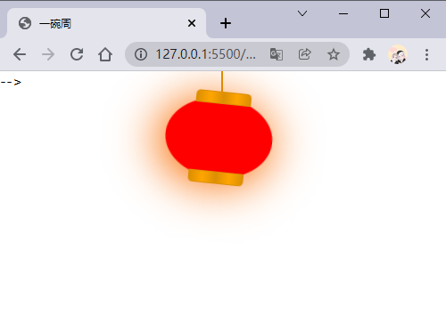

# 过年了~我用CSS画了个灯笼，看着真喜庆

## 写在前面

过年了~过年了~过年了~

辞旧迎新过年啦 张灯结彩春节啦~

金鸡起舞送福啦 新的一年福来啦~

文章开头几句歌词，顿时显得喜庆了不，我们的灯笼是下面这个样子的。


## animation属性

画灯笼我们肯定不能画一个静态的灯笼，我们先来复习一下CSS中的`animation`属性，该是是一个简写属性，由`[animation-name](https://developer.mozilla.org/zh-CN/docs/Web/CSS/animation-name)`，`[animation-duration](https://developer.mozilla.org/zh-CN/docs/Web/CSS/animation-duration)`, `[animation-timing-function](https://developer.mozilla.org/zh-CN/docs/Web/CSS/animation-timing-function)`，`[animation-delay](https://developer.mozilla.org/zh-CN/docs/Web/CSS/animation-delay)`，`[animation-iteration-count](https://developer.mozilla.org/zh-CN/docs/Web/CSS/animation-iteration-count)`，`[animation-direction](https://developer.mozilla.org/zh-CN/docs/Web/CSS/animation-direction)`，`[animation-fill-mode](https://developer.mozilla.org/zh-CN/docs/Web/CSS/animation-fill-mode)` 和 `[animation-play-state](https://developer.mozilla.org/zh-CN/docs/Web/CSS/animation-play-state)` 属性组成。这里我们就不展开讲解了，具体可以跳转到MDN学习。

我们先来看一下下面这个示例：

```CSS
animation: swing 3s infinite ease-in-out;
```


在上面的例子中使用了一个名为`swing`的动画序列，动画序列通过[`@keyframes`](https://developer.mozilla.org/zh-CN/docs/Web/CSS/@keyframes)创建，执行时间`3s`，动画循环执行，最后`ease-in-out`表示动画执行的节奏。

## 实现思路


- 为一个矩形添加`border-radius`使其，形成一个灯笼的外形。
- 为矩形添加`::before`和`::after`来形成灯笼的顶部和头部
- 画一个灯笼线。

- 在 矩形内部添加两个比较细的矩形，通过添加 border-radius 来形成灯笼的线条。

- 设置灯笼的动画效果

- 添加灯穗的样式

接下来我们就分步骤实现。

## 绘制灯笼外形

首先我们定义HTML结构，代码如下：

```HTML
<!-- 灯笼容器 -->
<div class="lantern-con">
  <!-- 提着灯笼的线 -->
  <div class="lantern-line"></div>
  <!-- 灯笼主要区域 -->
  <div class="lantern-light">
  </div>
</div>
```


然后我们画一个椭圆，然后通过`::before`和`::after`，绘制上下的两个灯笼盖，CSS如下：

```CSS
/* 灯笼容器 */
.lantern-con {
  position: fixed;
  left: 160px;
}

/* 灯笼中间红色区域 */
.lantern-light {
  position: relative;
  width: 120px;
  height: 90px;
  background-color: red;
  margin: 30px;
  border-radius: 50%;
  box-shadow: -5px 5px 50px 4px #fa6c00;
  /* 设置旋转点 */
  transform-origin: top center;
  animation: swing 3s infinite ease-in-out;
}

/* 灯笼顶部和底部的样式 */
.lantern-light::before,
.lantern-light::after {
  content: '';
  position: absolute;
  border: 1px solid #dc8f03;
  width: 60px;
  height: 12px;
  /* 背景渐变 */
  background: linear-gradient(
    to right,
    #dc8f03,
    #ffa500,
    #dc8f03,
    #ffa500,
    #dc8f03
  );
  left: 30px;
}

/* 顶部位置 */
.lantern-light::before {
  top: -7px;
  border-top-left-radius: 5px;
  border-top-right-radius: 5px;
}

/* 底部位置 */
.lantern-light::after {
  bottom: -7px;
  border-bottom-left-radius: 5px;
  border-bottom-right-radius: 5px;
}

/* 提着灯笼的线的样式 */
.lantern-line {
  width: 2px;
  height: 50px;
  background-color: #dc8f03;
  position: absolute;
  left: 88px;
}
/* 灯笼的动画效果 */
@keyframes swing {
  0% {
    transform: rotate(-6deg);
  }

  50% {
    transform: rotate(6deg);
  }

  100% {
    transform: rotate(-6deg);
  }
}

```


现在就实现了一个比较基础灯笼外形，效果如下：



## 灯笼内部线条

灯笼的内部线条是通过两个矩形实现了，通过`border-radius`属性将其设置为椭圆，然后绘制边，呈现灯笼线条。

```HTML
<div class="lantern-light">
  <!-- 灯笼中间的线条 -->
  <div class="lantern-circle">
    <div class="lantern-rect">
      <!-- 灯笼中间的文字内容 -->
      <div class="lantern-text">灯笼</div>
    </div>
  </div>
</div>
```


对应的CSS如下：

```CSS
/* 灯笼中间的线条 */
.lantern-circle,
.lantern-rect {
  height: 90px;
  border-radius: 50%;
  border: 2px solid #dc8f03;
  background-color: rgba(216, 0, 15, 0.1);
}

/* 外层 */
.lantern-circle {
  width: 100px;
  margin: 12px 8px 8px 10px;
}

/* 内层 */
.lantern-rect {
  margin: -2px 8px 8px 26px;
  width: 45px;
}

/* 文字样式 */
.lantern-text {
  font-size: 28px;
  font-weight: bold;
  text-align: center;
  color: #dc8f03;
  margin-top: 4px;
}
```


## 灯笼穗

现在我们来绘制一下灯笼穗，这个东西比较简单，最主要的是添加一个动画效果，其HTML结构如下：

```HTML
<!-- 灯笼主要区域 -->
<div class="lantern-light">
  <!-- more code -->
  <!-- 灯笼穗 -->
  <div class="lantern-tassel-top">
    <div class="lantern-tassel-middle"></div>
    <div class="lantern-tassel-bottom"></div>
  </div>
</div>
```


CSS如下：

```CSS
/* 灯穗 */
.lantern-tassel-top {
  width: 5px;
  height: 20px;
  background-color: #ffa500;
  border-radius: 0 0 5px 5px;
  position: relative;
  margin: -5px 0 0 59px;
  /* 让灯穗也有一个动画效果 */
  animation: swing 3s infinite ease-in-out;
}

.lantern-tassel-middle,
.lantern-tassel-bottom {
  position: absolute;
  width: 10px;
  left: -2px;
}

.lantern-tassel-middle {
  border-radius: 50%;
  top: 14px;
  height: 10px;
  background-color: #dc8f03;
  z-index: 2;
}

.lantern-tassel-bottom {
  background-color: #ffa500;
  border-bottom-left-radius: 5px;
  height: 35px;
  top: 18px;
  z-index: 1;
}
```


到这我们就把这个灯笼画完了。

## 写在最后

本篇文章到这就结束了，都看完了就点个赞支持一下，谢谢了~

